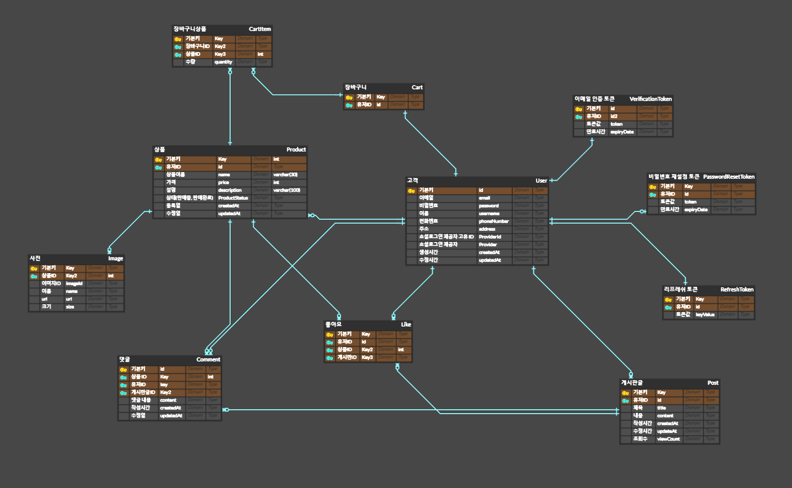

# LION SHOP

## 1. 프로젝트 개요

* **LION은 중고거래 플랫폼 이다.**
* **본인의 상품을 원하는 가격에 판매할 수 있다.**
* **상품을 사고 싶은 소비자의 경우 채팅으로 판매자에게 요청할 수 있다**
* **상품의 경우 카트(장바구니)에 담을 수 있다.**
* **다양한 사용자들이 소통할 수 있는 커뮤니티 공간이 있다.**
* **다양한 사용자들이 실시간으로 소통할 수 있는 그룹채팅 공간이 있다.**
* **로그인의 경우 회원가입을 통한 로그인과 소셜로그인이 있다.**

## 2. 사용한 기술 스택

## 3. 프로젝트 구조

## ERD

## 4. 기능

### ➡️ 구현되어 있는 기능.
#### :heavy_check_mark: 상품 CRUD
#### :heavy_check_mark: 카트 CRUD
#### :heavy_check_mark: 회원가입 및 로그인
#### :heavy_check_mark: 소셜 로그인 (카카오&깃허브&구글)
#### :heavy_check_mark: 게시글 CRUD
#### :heavy_check_mark: 댓글 CRUD
#### :heavy_check_mark: 채팅 기능
#### :heavy_check_mark: 이메일 인증 기능
#### :heavy_check_mark: 회원 찾기 기능
#### :heavy_check_mark: 게시글 및 상품 검색 기능
#### :heavy_check_mark: 게시글 조회수/추천수 기능

## 5. 배포

- **프론트엔드 : Vercel, 백엔드: NCP** 
- [LION 배포 링크](https://www.lionshop.me)
- **테스트용 아이디** :  
 test1 ~ test5 : 유저
 / ex) 아이디 : test1@test.com / 비밀번호 : test1

## 6. 팀원 소개

<table>
  <tbody>
    <tr>
      <td align="center"><a href=""> <b>BE 팀장 : 김겸호 </b></a> </td>
      <td align="center"><a href=""> <b>BE 팀원 : 박태훈 </b></a> </td>
      <td align="center"><a href=""> <b>BE 팀원 : 손경이 </b></a> </td>
      <td align="center"><a href=""> <b>BE 팀원 : 장다슬 </b></a> </td>
      <td align="center"><a href=""> <b>BE 팀원 : 전희영 </b></a> </td>
      <td align="center"><a href=""> <b>BE 팀원 : 원서연 </b></a> </td>
    </tr>
  </tbody>
</table>
